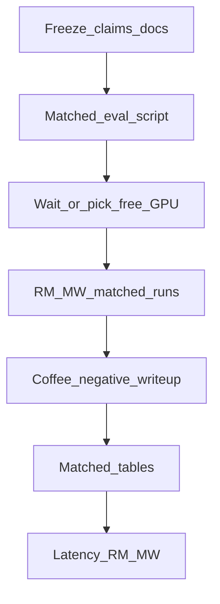

# ICRA — matched eval build plan (RoboMimic / MetaWorld)

Canonical detail: [oat/RESOLUTIONPLAN.md](oat/RESOLUTIONPLAN.md). This file = **executable recipe for our track only**.

## Ownership

- **Build this plan:** RoboMimic + MetaWorld matched BoN/AWR, tables, coffee negative, RM/MW latency.
- **Do not build here:** LIBERO experiments, other LIBERO suites, Diffusion Policy, contact-rich contrast (scientific lead).

## Goal / non-goals

**Goal:** matched-seed Δ for BoN/AWR vs baseline on fixed OAT ckpts so RM/MW can appear in the paper without protocol lies.

**Do not:** retrain for protocol polish; use chain5 mean as BoN comparator; call `1000–1049` a fresh held-out set; treat exploratory chain5↔quick Δ as paper claim; start Can while coffee/stick collect saturates GPU without a free device.

**Do:** shared fixed init set (`test_start_seed=1000`, `n_test=50`, `-n 3` for baseline **and** BoN **and** AWR); coffee = controlled negative; force CLI overrides (never Hydra defaults alone).



---

## Phase 0 — Freeze claims (docs)

1. RESULTS summary columns = exploratory vs chain5; paper Δ = matched (TBD until Phase 4).
2. [RESOLUTIONPLAN.md](oat/RESOLUTIONPLAN.md) + Limitations: ownership, **shared fixed init set** (not held-out), matched (not falsely “paired”).
3. Gate: no main-text RM/MW Δ without “exploratory” or matched numbers.

---

## Phase 1 — Tooling

**Invariant**

| Param | Value |
|-------|--------|
| `test_start_seed` | `1000` |
| `n_test` | `50` |
| `num_exp` (`-n`) | `3` |
| tokens | `--use_k_tokens 8 --entropy_threshold 0` |
| BoN | `--bon_free 8 --bon_signal vote` |

Add `oat/scripts/cluster_matched_triplet.sh`:

```bash
# SUITE=lift|can|square|mt4|coffee-pull|stick-pull|disassemble|box-close
# BASE_CKPT=... AWR_CKPT=... [optional] GPU=0|1
# → output/eval/matched/${SUITE}/{baseline_n3,bon_n8_n3,awr_n3}/ + summary.json
```

Always pass `--n_test 50 --test_start_seed 1000` (MT4 config default is 250).

**Reuse:** skip BoN/AWR re-run only if existing `eval_log.json` has `num_exp=3` and was run with the same init protocol; else re-run all three into `matched/`. Prefer clean matched dirs for paper paths.

**Ckpts** (resolve full paths on cluster before launch):

| Suite | Base | AWR |
|-------|------|-----|
| Lift | `ep-0600_sr-0.920.ckpt` | `my_models/policy_awr_lift.ckpt` |
| Can | `ep-1700_sr-0.940.ckpt` | `my_models/policy_awr_can.ckpt` |
| Square | `ep-0600_sr-0.420.ckpt` (not ep-1500) | `my_models/policy_awr_square.ckpt` |
| MT4 | `ep-0450_sr-0.280.ckpt` | `my_models/policy_awr_mt4.ckpt` |
| coffee-pull | `ep-1000_sr-0.432.ckpt` | AWR when collect/train finishes |
| stick-pull | `ep-0800_sr-0.212.ckpt` | AWR when ready |
| disassemble | `ep-1400_sr-0.700.ckpt` (chain5 **DONE** 66.4%) | after BoN→AWR pipeline |
| box-close | after train stops / best ckpt | after pipeline |

---

## Phase 2 — Runs (inference only)

Container `oat_mipt_robomimic_askhabaliev_gs`, `/workspace/oat`.

**Queue:** if `mw_coffee_bon_awr` / `mw_stick_bon_awr` still collecting, use the other GPU or wait — do not collide blindly.

Order: **Can → MT4 → coffee → stick → Lift → Square** → then box / disassemble.

Decision rules: Lift/Square stable + → main; Can/MT4 + → main else appendix; coffee −/~0 → controlled negative (Discussion); stick + → main.

No retrain unless a **main-table** suite needs a different selector/source.

---

## Phase 3 — Coffee

Matched baseline vs BoN (AWR if present).  
Seed0 chain5 (34%) = same-init single-sample reference only.  
Optional: `--bon_signal medoid`.  
Writeup: selection not always helpful / possible vote mode-seeking — **not** “short task ⇒ weak compounding” without evidence.

---

## Phase 4 — Tables (RESULTS)

- **Table A (paper, our track):** matched baseline | BoN | AWR | Δ | n_test=50 | notes  
- **Table B (appendix):** chain5 absolute SR — not BoN comparator  
- LIBERO load-bearing table = PI track (cite, don’t re-measure here)

Mark old chain5↔quick Δ superseded by `output/eval/matched/...`.

---

## Phase 5 — Latency (RM/MW)

`measure_latency_adaptive.py` / `measure_latency.py`: first **confirm** BoN N=8 is supported; batch=1; single vs BoN; report with Table A.

---

## Out of scope (PI) — do not execute in this build

- LIBERO re-eval / ordering ablation  
- Other LIBERO suites, Diffusion Policy, contact-rich PACE vs random  

---

## Do not

- Retrain for Δ polish  
- Put chain5−BoN Δ in abstract / main results  
- Pool LIBERO `n_test=500` with RM/MW `n_test=50`  
- Call coffee a bug  
- Call seeds “unused held-out” if they overlap train-eval  

## Success (this track)

- [ ] Matched Table A for every RM/MW suite in our main text  
- [ ] Can/MT4 matched or relegated  
- [ ] Coffee controlled negative with matched numbers  
- [ ] Chain5 appendix only  
- [ ] RM/MW latency next to selection  
- [ ] Limitations + RESOLUTIONPLAN terminology correct  

**Next when building:** implement `cluster_matched_triplet.sh`, then Can on a free GPU.
